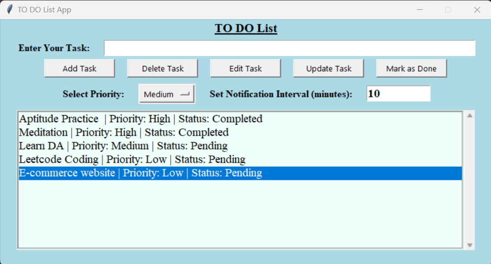

# To-Do List Desktop App with Notifications

## Description
This is a fully functional To-Do List desktop application built using Python and Tkinter. It allows users to add, edit, delete, and mark tasks as completed. The application automatically triggers notifications at a user-specified interval to remind them of pending tasks.

## Features
- **Task Management**: Add, edit, delete, and mark tasks as completed.
- **Priority Sorting**: Sort tasks by priority (High, Medium, Low).
- **Persistent Storage**: Tasks are saved to a file and loaded upon startup.
- **Automatic Notifications**: Sends reminders for pending tasks at user-defined intervals.
- **User-Friendly UI**: Simple and intuitive graphical interface using Tkinter.

## Installation
### Prerequisites
Ensure you have Python installed on your system. You also need the required dependencies:
```sh
pip install tk plyer
```

## Usage
1. Run the script:
   ```sh
   python todo_list.py
   ```
2. Enter your task in the text box.
3. Set the priority (High, Medium, Low) and click "Add Task".
4. Modify tasks using the "Edit", "Update", or "Mark as Done" buttons.
5. Set the notification interval (in minutes) and the app will automatically send reminders.

## File Storage
The tasks are stored in `tasks.txt` to ensure persistence between sessions.

## Notifications
The application automatically sends reminders at the specified interval, displaying all pending tasks.

## Screenshots


## License
This project is open-source and free to use.

## Author
Developed by **Mratyunjay Saxena**

